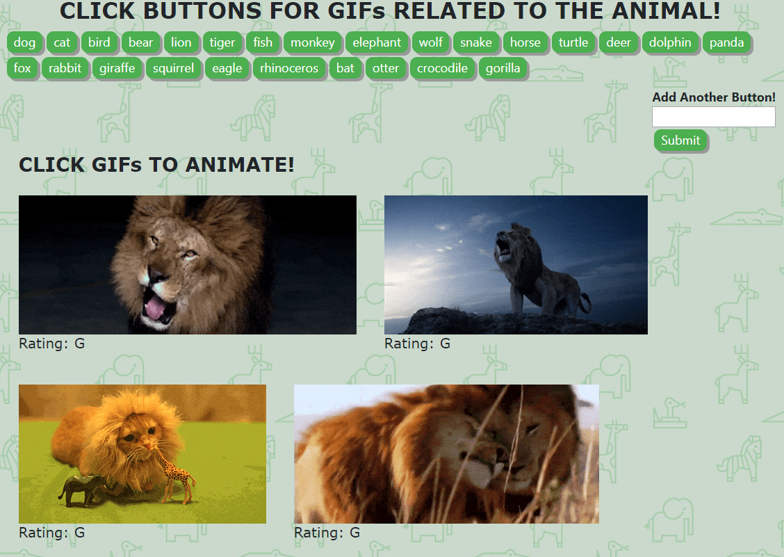

# GifTastic!
> Find gifs of your favorite animals or other user input topics.
## Deployed App
https://ehammons.github.io/GifTastic/

## Table of contents
* [General info](#general-info)
* [Screenshots](#screenshots)
* [Technologies](#technologies)
* [Features](#features)
* [Status](#status)
* [Inspiration](#inspiration)
* [Contact](#contact)

## General info
Add a new button to display new topic for gifs or use one of the preprogrammed buttons to explore gifs. Click on a GIF to switch from animation to still and back.

## Screenshots

## Technologies
* jQuery
* JavaScript
* GIPHY API

## Code Examples
    function renderButtons() {
        $("#buttons-view").empty();

        for (var i = 0; i < animals.length; i++) {
            var animal = animals[i];
            var button = $("<button>");
            button.addClass("animal");
            button.attr("data-animal", animal);
            button.text(animal);
            $("#buttons-view").append(button);
        }
    };

## Features
List of features ready and TODOs for future development:
### Features
* Preprogrammed buttons for easy access to GIFs immediately
* Add button feature to customize GIFs returned
* Works with any added topic, not just animals
### Future Development
* Create transparent box to hold GIFs so text doesn't blend with background
* Improve responsiveness

## Status
Project is: _finished_

## Inspiration
Inspired by a love of animals and simple outlines.
Based on the GifTastic assignment for The Coding Bootcamp at UT Austin.

## Contact
Created by Elise Hammons - feel free to contact me!
 [LinkedIn](https://www.linkedin.com/in/elise-h-01243258/)